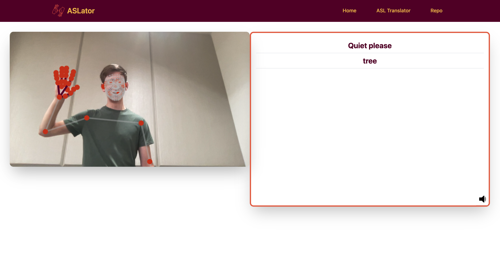

# ASLator

ASLator is a app that detects ASL using the camera of your device. It uses the [MediaPipe](https://google.github.io/mediapipe/) framework to detect the hand landmarks and then uses a neural network to classify the hand gestures.

## Inspiration

Our inspiration for ASLator stems from a personal connection to the deaf community. My cousin, who is deaf and an ardent ASL user, inspired us to bridge the communication gap. We witnessed the challenges she faced when technology couldn't fully assist her in everyday interactions. ASLator is our way of ensuring that individuals like her can communicate effortlessly with the world, harnessing the power of technology to make a meaningful impact in their lives.

## What it does

ASLator is a groundbreaking app designed to enhance communication for the deaf and hard of hearing. By leveraging the capabilities of your device's camera, ASLator detects American Sign Language (ASL) gestures in real-time. Powered by the innovative MediaPipe framework and a transformer model, it precisely identifies hand landmarks and interprets ASL signs. Whether you're a sign language learner or looking to bridge the communication gap, ASLator provides an intuitive and accessible way to understand and utilize ASL, fostering inclusivity and connection in a digital world.

## How we built it

Our final stack consisted of the following technologies:

- [React](https://reactjs.org/) for the frontend
- [MediaPipe](https://google.github.io/mediapipe/) for hand landmark detection
- [TensorFlow](https://www.tensorflow.org/) for the asl model
- [FastAPI](https://fastapi.tiangolo.com/) for serving the model
- [Docker](https://www.docker.com/) for containerization
- [Github](https://www.github.com/) for version control
- [OpenAI](https://openai.com/) for the GPT-3 API

Our frontend downloads the MediaPipe model and has a neat code that checks if the user is signing. If the user is signing, it sends the hand landmarks to the backend. The backend then runs the model on the hand landmarks and returns the prediction to the frontend. If there are multiple signs we send the sliding window results to the GPT-3 API to get a sentence. We then display the sentence on the frontend.

## Challenges we ran into

1. We ran into issues implementing the data preprocessing for the model. Specifically we were stuck a long time not realizing that it required nan values instead of zeroed out ones.
2. There was another bug that took a long time to figure out. The frontend code that was processing the MediaPipe output and detecting when the person was signing was overwriting it's saved data. This led to a lot of confusion.

## Accomplishments that we're proud of

1. We are proud of the fact that we were able to implement a working model and integrate it with the frontend.
2. We had a clever stagey in detecting when there user stared and stopped signing.
3. We are also proud of our neat hack to get the model to work on multiple signs in sequence. We used a sliding window to run the model multiple times and get good results.

## What we learned
1. We learned how to use the MediaPipe framework to detect hand landmarks.
2. We learned how to use the TensorFlow framework to train a multi-attention model.
3. We improved on our knowledge of using FastAPI framework to serve a model and explored the idea of multi-threading.

## What's next for ASLator

1. We want to incorporate a better model that can do more than just a small set of signs.
2. It would also be nice to have a smoother and faster experience. Currently you have to be a bit patient for the model.
3. This app could be integrated with other video call and or text messaging applications.